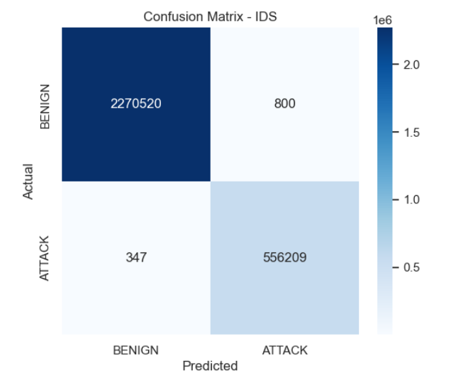
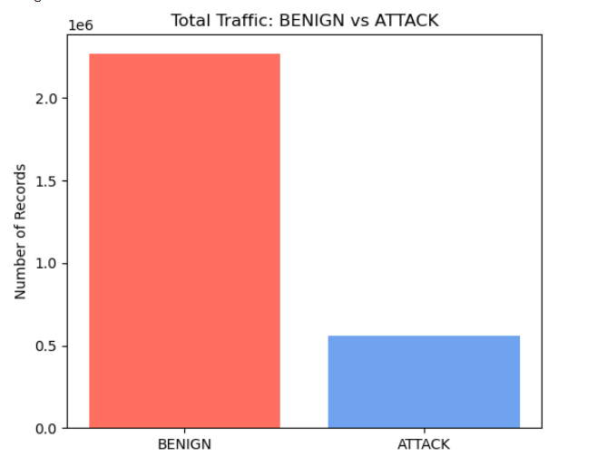
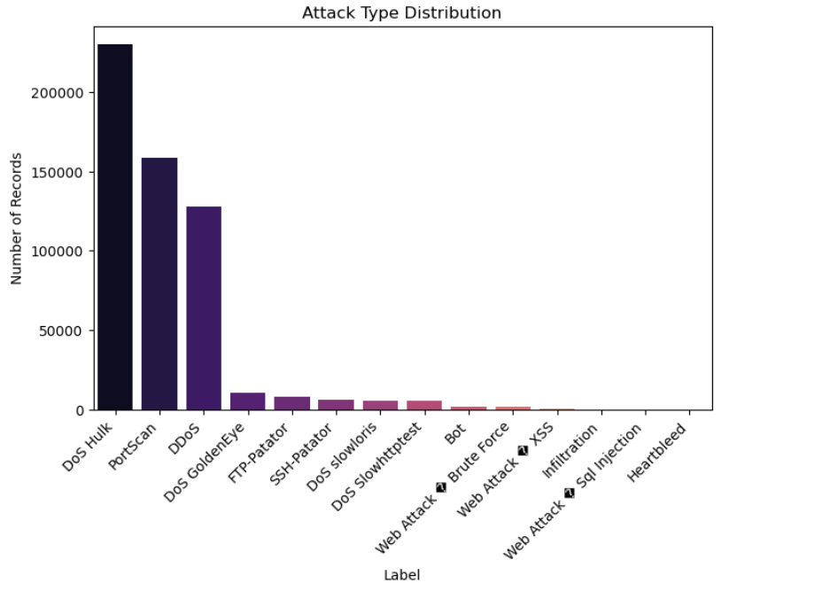
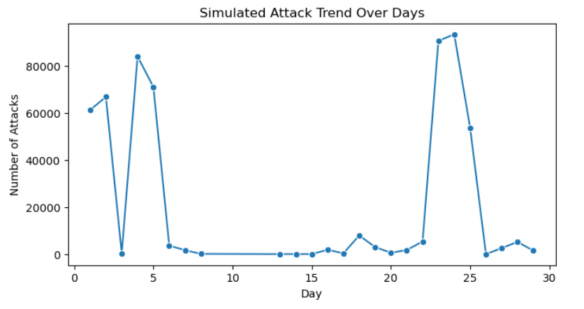

# AI-Based Intrusion Detection System (IDS)

This project implements an AI-based Intrusion Detection System using the CICIDS 2017 dataset.
It simulates a SOC workflow including detection, alert generation, and visualization.

## Features
- Data preprocessing and cleaning
- Machine learning model (Random Forest)
- Attack classification (Benign vs Attack)
- SOC-style alert generation
- Visual dashboard using Jupyter Notebook
- Attack trend and distribution analysis

## Dataset
- CICIDS 2017

## Tools & Technologies
- Python
- Jupyter Notebook
- Pandas, NumPy
- Scikit-learn
- Matplotlib, Seaborn

## Project Structure
AI_IDS_Project/
├── notebooks/
├── data/
├── models/
├── screenshots/
├── README.md

## 📊 Project Visualizations

### Confusion Matrix

### Total Traffic Distribution

### Attack Type Distribution

### Attack Trend (Simulated)

## How to Run
1. Open notebooks folder
2. Run notebooks in order
3. View alerts and charts in SOC notebook

⚠️ Dataset files are not included due to size limits.  
Download CICIDS 2017 from Kaggle before running notebooks.
